# Skinning & Skeletal Animation

Name: Svitlana Morkva

## Reports

### Task 2: Rotation Representation discussion
#### Task 2.1. compare different rotation representations

| Representions        |                                                                         Short Description                                                                         |                                                                                         pros                                                                                          |                                                                                                             cons                                                                                                             |
| :------------------: |:-----------------------------------------------------------------------------------------------------------------------------------------------------------------:|:-------------------------------------------------------------------------------------------------------------------------------------------------------------------------------------:|:----------------------------------------------------------------------------------------------------------------------------------------------------------------------------------------------------------------------------:|
| rotation matrix      |                           Matrix 3x3 with columns of unit length, mutually orthogonal, with determinant=1. All elements are parameters.                           | - Simple representation   - Rotation is a linear function of the parameters.  - Trivial to compute the rotation and partial derivatives   - Can use linear optimizations. |                                         - Need to add 6 non-linear constraints for the matrix to still be in SO(3)   - Redundant information (only 3 DOF but uses 9 parameters)                                          |
| euler angles         |             3 parameters that represent the rotation around one of the coordinate axes that uses 3 nonlinear functions to compute rotation matrices.              |                        - Simple representation   - Rotations and derivatives are easy to compute.   - Provides user-friendly interface for animators.                         | - "Gimbal lock" - rotation loses one DOF in some cases   - Poor interpolation of rotation   - Need to choose the rotation sequence   - Unsuitable for many applications as can't naturally represent most joints |
| axis angle           |                                           Rotation is represented by an axis vector (usually normalized) and an angle.                                            |                                                                - Compact representation   - Intuitive to work with                                                                |                                                    - Can't interpolate linearly   - Numerical errors   - Infinite number of pairs that refer to the same rotation                                                    |
| quaternion_mode          | Represented by 4-dimensional vector, where first 3 components encode (with some construnction form, not straightforward) a unit axis and 4th - a rotation radians |                - Parial derivatives are linearly independent - no gimbal lock   - Supports nice interpolation  - Computationally efficient to apply rotations                 |                                             - Need to re-normalize after every integration step and impose additional constraints to maintain unit length  - Less intuitive                                              |

#### Task 2.2. Theoretical question for dual quaternion_mode

|                                                                                                       Euler angles -> rotation  matrix                                                                                                        |                                                                                             rotation matrix -> quaternion                                                                                              |                                                                            quaternion + translation -> dual quaternion                                                                             |
|:---------------------------------------------------------------------------------------------------------------------------------------------------------------------------------------------------------------------------------------------:|:----------------------------------------------------------------------------------------------------------------------------------------------------------------------------------------------------------------------:|:--------------------------------------------------------------------------------------------------------------------------------------------------------------------------------------------------:|
| At first, we need to construct 3 matrices for the corresponding angle.  They will encode the rotation around each of the axes.  Then we can multiply these matrices in some specified order (12 cases) and it will produce the rotation matrix. | To calculate components of quaternion we need to:   1. w = sqrt(1 + trace(R)) / 2   2.x = (R[2, 1] - R[1, 2]) / (4w)   3. y = (R[0, 2] - R[2, 0]) / (4w)   4. z = (R[1, 0] - R[0, 1]) / (4w)   5. normalize the quaternion | Real part is q = (w, x, y, z) and the dual part is d = (0, dx, dy, dz), where dx = tx * w / 2, dy = ty * w / 2, and dz = tz * w / 2.  The dual quaternion is then Q = (w, x, y, z, 0, dx, dy, dz).  | 

### Task 3: animation of the skeleton
|                       from rotaton matrix                       |                     from quaternion_mode                      |
|:---------------------------------------------------------------:|:-------------------------------------------------------------:|
| 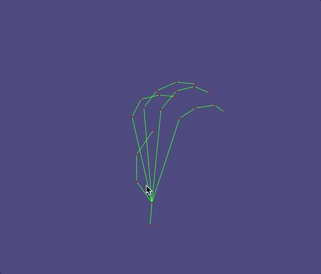 | 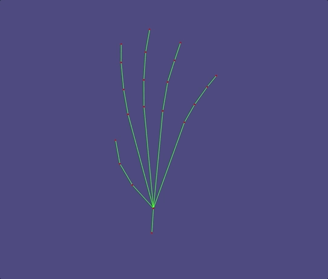 |

As you can see, rotation representation with quaternions gives us much smoother animation because it has nice interpolation
properties, and it's also faster and more convenient for animators to just give the rotation for the last frame than calculate
rotations for each frame. 

### Task 4: computing harmonic skinning weights on selected handles
#### Task 4.1. handle selection
|      shape name      |                          joint 1                          |                          joint 2                          |                          joint 3                          |
|:--------------------:|:---------------------------------------------------------:|:---------------------------------------------------------:|:---------------------------------------------------------:|
| hand (calculated h.) | 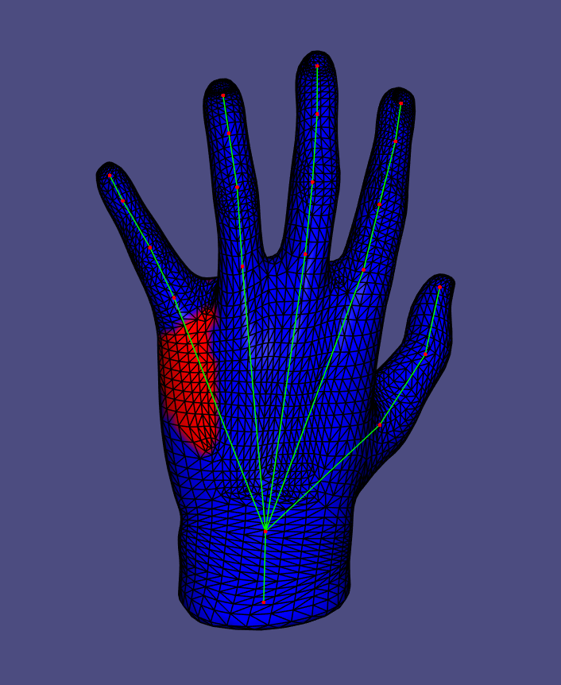  | 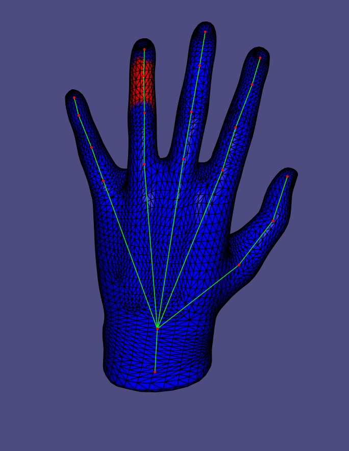  | 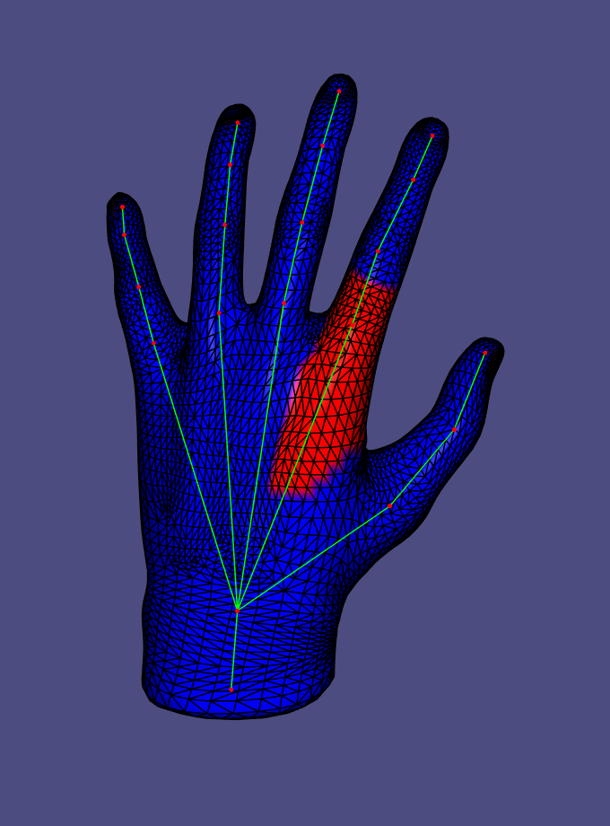  |
|   hand (given h.)    | 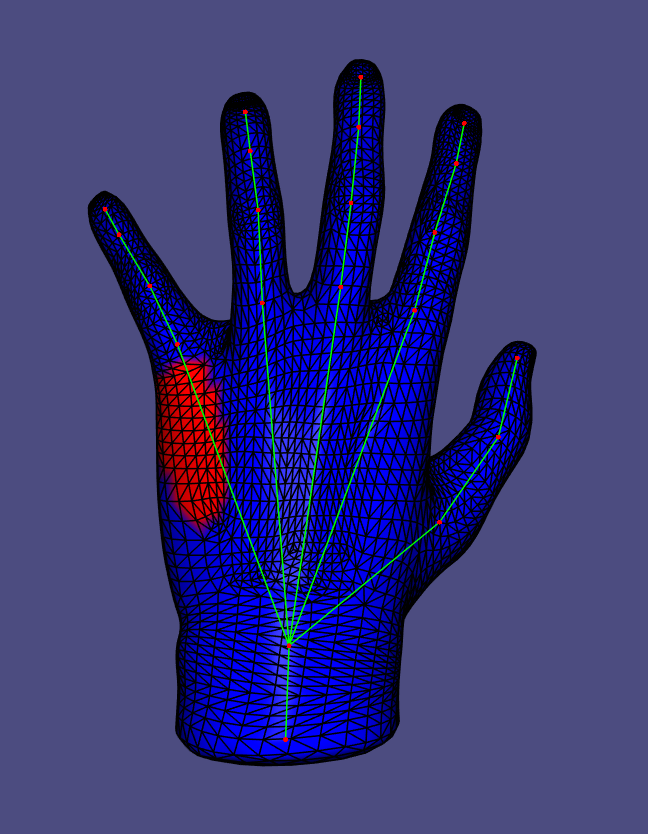 | 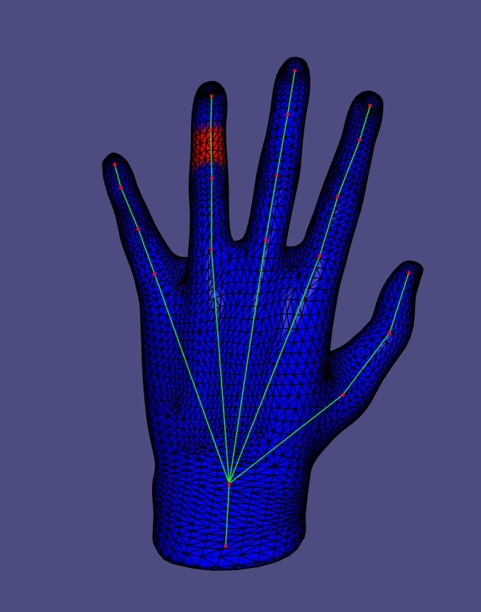 | 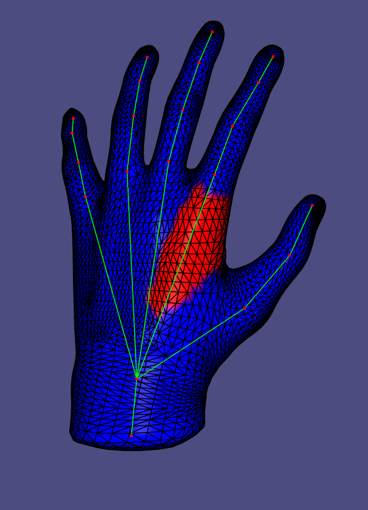 |

I calculated handles using Geometric Selection with the scale factor 2 (instead of 1.5). This method much faster than manual selection,
but it suffers from some downsides. Even though for many bones it managed to find nice handles, we can get bad handles if there is the vertex
near the bone, but the majority of them are much further. I got this situation for the root bone, the vertices on the bottom of the hand are close to the bone,
but the hand itself is far away, so we don't get the handle around the bone, but just below. For these cases it would be better to create cylinder around the bone.

#### Task 4.2. skinning weights visualization
| shape name           |                          joint 1                           |                          joint 2                           |                          joint 3                           |
| :------------------: |:----------------------------------------------------------:|:----------------------------------------------------------:|:----------------------------------------------------------:|
| hand | 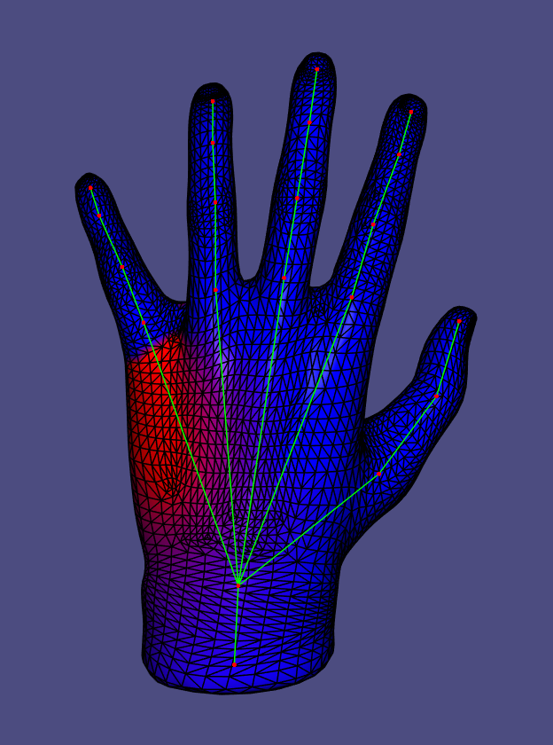 | 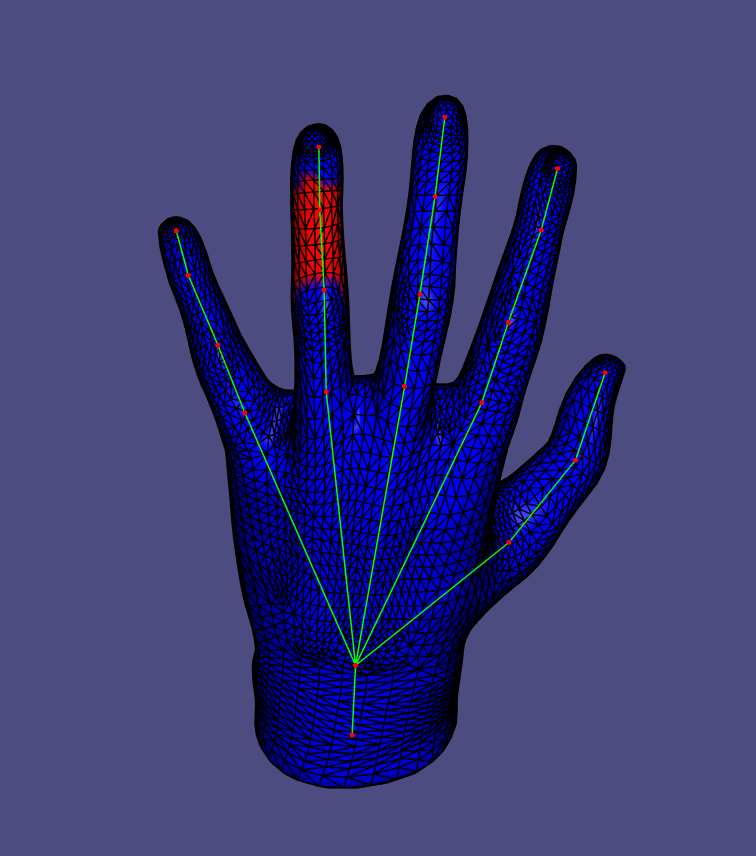 | 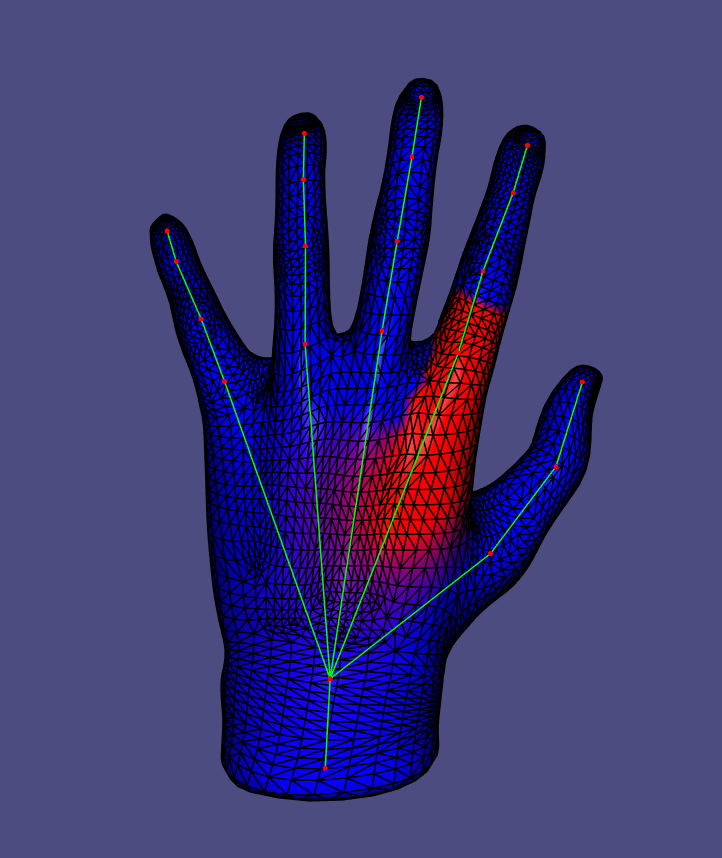 |

### Task 5/6/7: skeletal animation 
|           Task 5: per-vertex + rotation + Lerp           |        Task 6: per-vertex + quaternion + Nlerp        |           Task 7: per-face + quaternion + Slerp           |
|:--------------------------------------------------------:|:-----------------------------------------------------:|:---------------------------------------------------------:|
|  |  |  |

|                                                                                                                 Task 5: per-vertex + rotation + Lerp                                                                                                                  |                                                                                                                                           Task 6: per-vertex + quaternion + Nlerp                                                                                                                                           |                                                                                                                          Task 7: per-face + quaternion + Slerp                                                                                                                           |
|:---------------------------------------------------------------------------------------------------------------------------------------------------------------------------------------------------------------------------------------------------------------------:|:---------------------------------------------------------------------------------------------------------------------------------------------------------------------------------------------------------------------------------------------------------------------------------------------------------------------------:|:----------------------------------------------------------------------------------------------------------------------------------------------------------------------------------------------------------------------------------------------------------------------------------------:|
| The simpest method out of 3. New vertices calculated just as propogation of transformations from the bones using previously calculated skinning weights.  The method suffers a lot from weird shape foldings (ex. near big finger) and lost of volume (knuckles). | A bit more advanced method, but still transformations are applied directly to vertices. In this method we use dual quaternions and they can provide some visual advantages.   The most significant - volume preservation, we can clearly observe it near knuckles, but other from that differences are not significant. | This method gave me the best visual results. Here we apply weights not to the vertices, but to faces and then perform Poisson stitching, to combine faces again.   We can clearly see improvements in volumes and also the movements by themselves look more natural, in my opinion. |

### Task 8.1: context-aware per-vertex LBS
#### Task 8.1.1 visualize the unposed example shapes
| shape name           |  pose 1             |   pose 2            |   pose 3            |
| :------------------: |:------------------: |:------------------: |:------------------: |
| human | 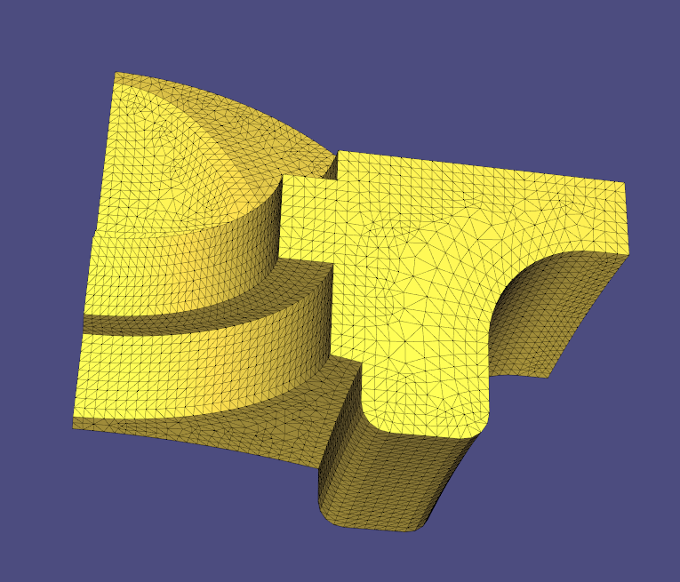  |  |  |

#### Task 8.1.2 skeletal animition using context

| without context   | with context     | 
| :---------:                            |        :---------:                           |  
|  |  |  
